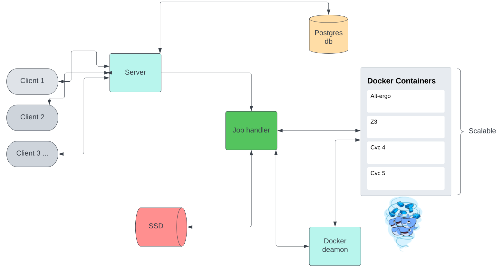

# ProofBox : Docker-compose platform providing SMT solvers services

`ez_proofbox` is a docker platform designed as a server intended to provide services for SMT solvers.

The current version is designed as a [Starexec](https://www.starexec.org) clone.

This work was done during my internship at [Ocamlpro](https://ocamlpro.com/)

[StarExec]: https://www.starexec.org	"Starexec"

